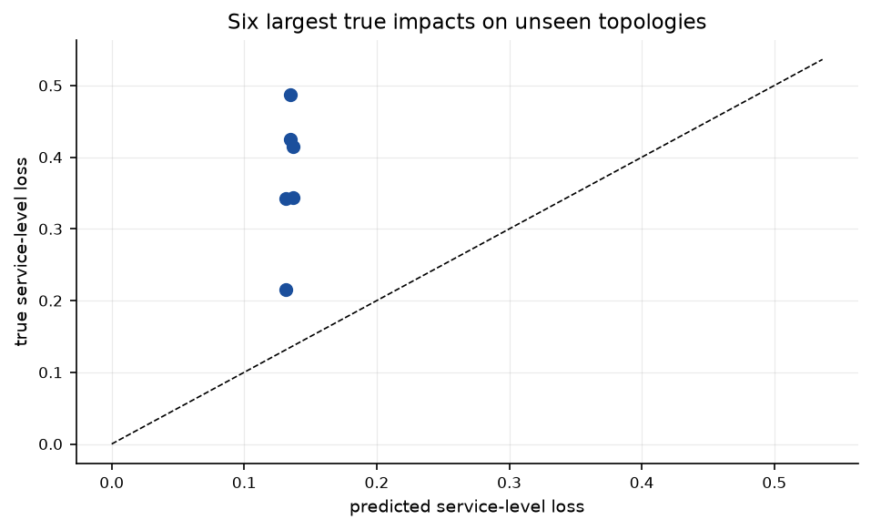
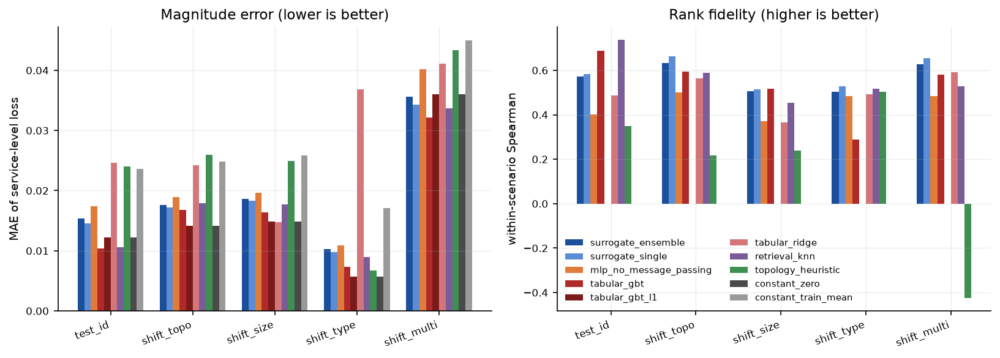
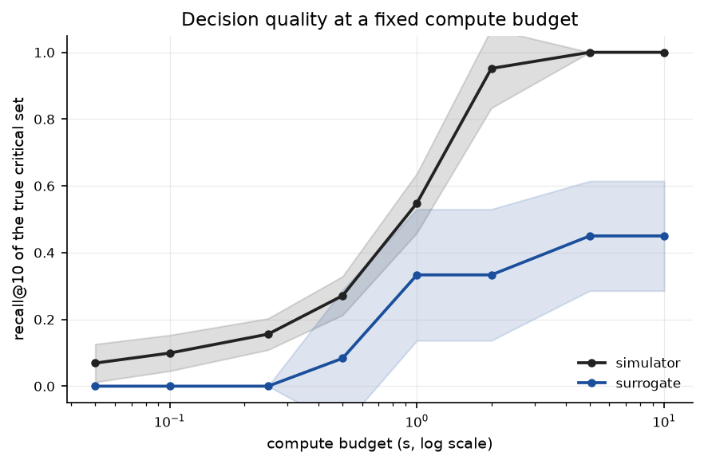
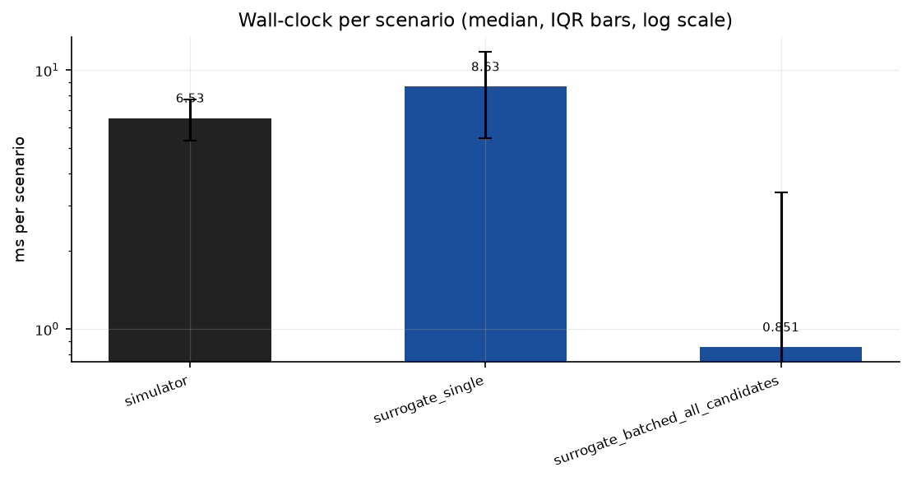
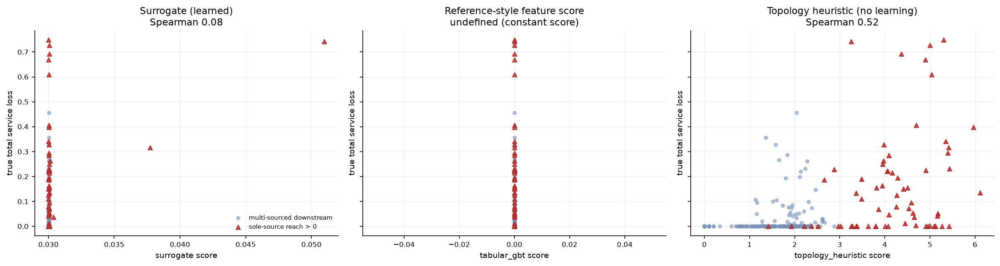

# Counterfactual Impact, Not a Risk Score

<!-- links:begin -->
**[▶ Try the live demo](https://huggingface.co/spaces/ARslan-Ahamd/supply-network-disruption-surrogate)** &nbsp;·&nbsp; **[Full results](https://supply-surrogate-arslan.surge.sh)** &nbsp;·&nbsp; [All seven projects](https://seven-ai-projects-arslan.surge.sh)

<sub>The demo runs this repository's own code in your browser via Pyodide — no server, nothing uploaded.</sub>
<!-- links:end -->

> **A learned temporal graph surrogate for a multi-echelon supply-network
> simulator — validated against that simulator as an exact oracle.**

The reference approach scores suppliers: features go into a classifier, out comes
a risk number. This repository argues that is the wrong object and replaces it
with a **counterfactual** — *if this node fails for eight periods, what happens
to service level at each demand point, when does it bite, and how long until
recovery* — then adjudicates the two approaches against the simulator's ground
truth instead of against a proxy.

---

## Summary for the reader in a hurry

|  | Finding | Status |
|---|---|---|
| ✅ | **36 of 36** adjudicated disagreements resolve in favour of counterfactual ranking | **Robust** |
| ✅ | On a **held-out disruption mechanism**, the surrogate transfers where the tabular model does not: Spearman **0.503 vs 0.288, +8.90σ** | **Largest surviving margin** |
| 🐛 | **This repository found a degenerate baseline in its own results** — a "reference GBT" that emitted `0.000000` on all 20,624 rows and survived 43 commits | **Self-corrected** |
| ❌ | A **learning-free topology heuristic beats the surrogate** on every criticality metric | **Negative** |
| ❌ | The **magnitude claim stays retracted** — now against a GBT that actually fits, not a constant | **Retracted** |
| ⚠️ | 11.41× per-scenario speed-up, but **break-even is 13,270 scenarios** — at realistic sweep sizes the simulator wins | **Honest cost** |

**Contents** ·
[The bug](#1-a-correction-that-comes-first) ·
[What holds](#2-what-holds-the-counterfactual-argument) ·
[What was retracted](#3-what-was-retracted) ·
[Efficiency](#4-efficiency-and-the-experiment-it-loses) ·
[Reproduce](#5-reproduce) ·
[Citation](#7-citation)

---

## 1. A correction that comes first

> [!CAUTION]
> An earlier release retracted this repository's magnitude-fidelity claim on the
> grounds that the surrogate *"loses to a reference GBT on 4 of 5 splits."*
> **There was no reference GBT.**

`TabularRiskModel(kind="gbt")` was configured with `loss="absolute_error"` to
"match the surrogate's L1 objective". The target is **92.48% exact zeros**
(19,073 of 20,624 rows), so the L1-optimal constant is the median — and the
median is exactly 0.

| symptom | value |
|---|---|
| unique predictions emitted | **1** |
| predicted value, all 20,624 rows | **0.000000** |
| total tree nodes | 30 |
| early stopping fired after | 10 rounds |

Its prediction vector is *element-wise identical* to an all-zero predictor's.
**What beat the surrogate was the constant zero function** — and pooled MAE on a
target like this is minimised by predicting zero, so that "defeat" was a property
of the metric, not of a rival model.

### The corrected statement is worse, not better

**One.** The surrogate is beaten on pooled MAE by the constant zero function on
**6 of 7 splits** (0.014581 vs 0.012246 on `test_id`). But on the one magnitude
metric a constant *cannot* win — MAE restricted to rows where a disruption
actually bit — it beats the all-zero constant on **all 7 splits** (0.1569 vs
0.2137 on `test_id`, +2.25σ to +6.20σ). The model has learned something about
magnitude; it spends that skill being wrong on the 92.5% of rows whose answer is
zero, and pooled MAE weighs those rows 12 to 1.

**Two.** Fixing the loss produced a genuinely strong baseline, **and it beats the
surrogate outright**:

| metric on `test_id` | `tabular_gbt` (fixed) | `surrogate_single` | winner |
|---|---|---|---|
| MAE | **0.0104** | 0.0146 | GBT |
| MAE on nonzero truth | **0.0945** | 0.1569 | GBT |
| top-1 agreement | **0.729** | 0.583 | GBT |

> **The magnitude claim stays retracted — now against a model instead of a
> constant.**

**The same bug contaminated the headline experiment.** `find_disagreements` ranks
candidates by `argsort` of the feature score, and `argsort` of a constant returns
index order, so all 36 adjudicated disagreements had `rank_a_feature == node_a + 1`:
the "node the feature score ranks first" was simply the lowest-numbered
candidate. Re-run against a GBT that ranks, **the conclusion survives — 36 of 36 —
now on real ranks. The evidence was invalid; the claim was not.**

> [!NOTE]
> **The guard that now exists.** A run fails if any method not declared
> constant-by-design emits fewer than two distinct predictions, and
> `constant_zero` / `constant_train_mean` are **permanent rows in every
> comparison table** — because the reason this went unnoticed for 43 commits is
> that there was no row saying what predicting nothing scores.

<details>
<summary><b>The full method table, with the constants left in as permanent rows</b></summary>

<br>

| method | MAE ↓ | MAE nonzero ↓ | RMSE ↓ | Spearman within-scenario ↑ | top-1 agree ↑ | unique preds |
|---|---|---|---|---|---|---|
| `surrogate_ensemble` | 0.0153 | 0.1649 | 0.0554 | 0.5715 | 0.5208 | 1077 |
| `surrogate_single` | 0.0146 | 0.1569 | 0.0531 | 0.5824 | 0.5833 | 982 |
| `mlp_no_message_passing` | 0.0174 | 0.2071 | 0.0685 | 0.4018 | 0.2292 | 206 |
| **`tabular_gbt`** (fixed) | **0.0104** | **0.0945** | **0.0366** | 0.6867 | **0.7292** | 766 |
| `tabular_gbt_l1` *(degenerate)* | 0.0122 | 0.2137 | 0.0696 | not measured | 0.1250 | **1** |
| `tabular_ridge` | 0.0246 | 0.1676 | 0.0616 | 0.4866 | 0.4583 | 978 |
| `retrieval_knn` | 0.0106 | 0.1093 | 0.0412 | **0.7368** | 0.6458 | 275 |
| `topology_heuristic` | 0.0240 | 0.1896 | 0.0668 | 0.3486 | 0.1250 | 132 |
| `constant_zero` *(control)* | 0.0122 | 0.2137 | 0.0696 | not measured | 0.1250 | **1** |
| `constant_train_mean` *(control)* | 0.0236 | 0.2022 | 0.0685 | not measured | 0.1250 | **1** |

`tabular_gbt_l1` and `constant_zero` are numerically identical — that is the
point, and deleting the row would hide how this happened.

</details>

---

## 2. What holds: the counterfactual argument

Across six unseen networks there are 36 candidate pairs the reference-style
feature score and the counterfactual ranking order **oppositely**. The simulator
resolves **36 of 36 in favour of the counterfactual.**

| | mean true service loss | extremum |
|---|---|---|
| nodes the feature score **prefers** | **0.000926** | max 0.033346 |
| nodes it **passes over** | **0.426345** | min 0.228754 |

In `shift_4`, every one of the feature score's top five candidates has a true loss
of **exactly 0.0000**, while the node it ranks **46th of 46** has the largest true
loss in the network at **0.7430**.

<p align="center">
  
  
  <br><sub><b>Figure 1.</b> Left: agreement with the simulator on the nodes that actually matter. Right: transfer to a disruption mechanism never seen in training.</sub>
</p>

### Three more results that survive the noise gate

| claim | measured | verdict |
|---|---|---|
| **Held-out mechanism transfer** — ensemble Spearman 0.503 vs GBT 0.288 | **+8.90σ** | ✅ largest surviving margin here |
| **Message passing is load-bearing** — the only ablation that clears noise | **+4.11σ** | ✅ robust |
| **Uncertainty orders errors** — error-detection AUROC | **0.99** | ✅ robust |
| MAE-on-nonzero beats the zero predictor on 7/7 splits | +2.25σ to +6.20σ | ✅ survives |

> The tabular model **interpolates the mechanisms it trained on; the surrogate
> transfers to one it has never seen.** That is the single strongest argument in
> this repository for learning a simulator rather than fitting a risk score.

---

## 3. What was retracted

<details open>
<summary><b>A learning-free topology heuristic beats the surrogate on every criticality metric</b></summary>

<br>

| metric | topology heuristic | surrogate |
|---|---|---|
| recall@10 | **0.633** | 0.433 |
| Spearman | **0.568** | 0.207 |

No training, no data generation, no GPU. If the task is *rank the critical
nodes*, the honest recommendation from this repository's own evidence is to use
the heuristic.

</details>

<details>
<summary><b>Retracted: "the worst node ranks 44th–46th of 46 by features"</b></summary>

<br>

An artefact of the constant baseline — with a constant score, `argsort` returns
node-id order, so "ranked 46th" meant "highest node id". Against a working
feature model the worst-true node's feature rank is **45, 20, 4, 41, 46 and 25**
across the six networks. It lands in the bottom third in three of six, and in
`shift_2` the feature score ranks it **4th** — i.e. nearly gets it right.

</details>

<details>
<summary><b>Three further negatives</b></summary>

<br>

- **Intervals are not calibrated**: 0.967 coverage at a nominal 0.50, and σ does
  not rise under distribution shift.
- **Plain retrieval beats the surrogate in-distribution** by 3.86σ.
- **The fixed-compute experiment is lost** — see §4.

Full account: **[docs/RESULTS.md](docs/RESULTS.md)** §8.7.

</details>

---

## 4. Efficiency, and the experiment it loses

One disruption scenario costs **50.33 ms** in the simulator against **4.41 ms**
batched through the surrogate — a measured **11.41×** (warm-up 8, 25 repeats,
median and IQR).

> [!WARNING]
> **The saving only repays the training and dataset-generation budget after
> 13,270 scenarios** (26,167 if the ensemble is charged). At any realistic sweep
> size the simulator is simply the better tool. The speed factor is real; the
> fixed-compute experiment is one the surrogate loses.

Given a wall-clock budget, how many of the truly critical nodes does each
approach find?

| compute budget (s) | simulator recall@k | surrogate recall@k |
|---|---|---|
| 0.05 | **0.069** | 0.000 |
| 0.10 | **0.099** | 0.000 |
| 0.25 | **0.156** | 0.000 |
| 0.50 | **0.271** | 0.083 |
| 1 | **0.548** | 0.333 |
| 2 | **0.952** | 0.333 |
| 5 | **1.000** | 0.450 |
| 10 | **1.000** | 0.450 |

**The surrogate never wins a row.** It is reported because a per-scenario speed
ratio that ignores training cost is the most common way an efficiency claim
misleads.

<p align="center">
  
  
  <br><sub><b>Figure 2.</b> Left: the fixed-compute experiment the surrogate loses at every budget. Right: the per-scenario cost it wins on.</sub>
</p>

<p align="center">
  
  <br><sub><b>Figure 3.</b> Predicted criticality against the truth. The collapsed L1 model appears as a literal vertical line at 0.00 — this is what a degenerate baseline looks like when you finally plot it.</sub>
</p>

---

## 5. Reproduce

```bash
git clone https://github.com/arslan-ahm/supply-network-disruption-surrogate.git
cd supply-network-disruption-surrogate
uv sync

uv run pytest -q                                   # 373 passing, 2 xfail
uv run python scripts/compare_methods.py           # §1 table, incl. the constant controls
uv run python scripts/adjudicate.py                # the 36-of-36 experiment
uv run python scripts/benchmark_efficiency.py      # §4
```

CPU only, no dataset download — the multi-echelon simulator is in-repo and
deterministic given a seed.

---

## 6. Repository layout

```
src/snds/     simulator, graph surrogate, tabular & heuristic baselines, claims
scripts/      compare_methods · adjudicate · benchmark · seed_study
configs/      YAML experiment definitions
notebooks/    01 network · 02 simulator · 03 surrogate · 04 criticality · 05 budget
results/      tables/ (CSV, authoritative) · figures/ · runs/
docs/         METHOD.md · RESULTS.md · REPRODUCIBILITY.md
tests/        375 tests
```

---

## 7. Citation

```bibtex
@software{ahmad2026snds,
  author = {Ahmad, Arslan},
  title  = {Counterfactual Impact, Not a Risk Score: A Temporal Graph Surrogate
            for Supply-Network Disruption},
  year   = {2026},
  url    = {https://github.com/arslan-ahm/supply-network-disruption-surrogate}
}
```

**Reference work.** The task framing was taken from
[SupplyShield-AI-Powered-logistics-guardian](https://github.com/HabibaSajid321/SupplyShield-AI-Powered-logistics-guardian)
by **Habiba Sajid**, which scores supplier risk from tabular features. That
repository carries no licence and no associated publication, so no citation is
requested and none of its code is reused; it is credited here as the origin of
the problem statement.

---

## License

MIT — see [LICENSE](LICENSE).
